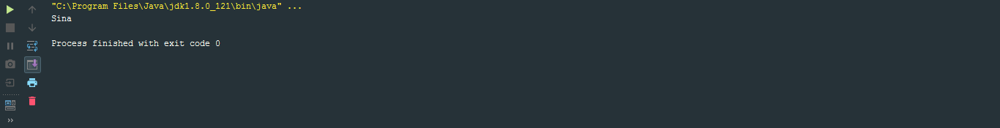
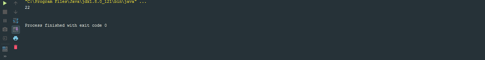

<div dir="rtl">

# کلاس ها در کاتلین

برای تعریف یک کلاس به همین سادگی نوشتن خط کد زیر کافی است

</div>

```kotlin
class Customer
```

<div dir="rtl">

من درواقع هیچ گونه نیازی به باز کردن یا بستن آکولاد یا هر کاری شبیه این ها ندارم.تنها کلیدواژه class و بعد ان نام class .

خب به هر حال کلاسمون نمیشه انقدر ساده باشه، کلاسمون باید مثل زبون های دیگه property یا خاصیت داشته باشه. اگه بخوام property داشته باشم باید اکولاد رو باز و بسته کنم. البته که تعریف یک خاصیت خیلی سادس، به راحتی خط زیر

</div>

```kotlin
class Customer{
    var id = 0
}
```

<div dir="rtl">

اگه دقت کنیم متوجه میشیم که تعریف خاصیت دقیقا به مانند تعریف متغیرهاست و به مانند متغیر ها لازم نیست که صریحا بیان کنم که چه نوع متغییر میخوام و میتونم تایپش رو مشخص نکنم. اگه بخوام این کارو انجام بدم به همین راحتی میتونم بیانش کنم

</div>


```kotlin
var name : String = ""
```

<div dir="rtl">

یکی از ویژگی های کاتلین که این زبون رو متفاوت از زبون دیگه میکنه اینه که مفهومی به نام field در این زبون وجود نداره پس هرچیزی که بعد تعریف کلاس معرفی میشه همون خاصیت ها یا property هان. همینطور به مانند متغیر ها ما میتونیم متغیر غیرقابل تغییر بسازیم، همونایی که با کلید واژه val مشخص میشدند.

حالا اگه من بخوام از این کلاس استفاده کنم

</div>

```kotlin
class Customer{
    var id = 0
    var name : String = ""
}

fun main(args: Array<String>) {
    var customer = Customer()
}
```

<div dir="rtl">

به همین راحتی، اگه توجه کنین کلیدواژه new که قبلا در جاوا استفاده میشد اینجا نیست. درواقع نیازی به new در اینجا نداریم. برای دسترسی به خاصیت ها 

</div>

```kotlin
customer.id = 10
customer.name = "Sina"
```

<div dir="rtl">

تنها کاری که باید بکنیم استفاده از "." است.

ولی اگه نگاه کنید من اومدم و خاصیت هارو مقدار دهی کردم، ولی اگر بخوام خاصیت هام مقدار دهی نشده باشند چی ؟ درواقع مسلما من زمانی میخوام مقدار دهی اولیه نکنم که اون ها مثلا توی سازنده ( Constructor ) مقدار دهی بشن.

خب اول بیام مقدار اولیه خاصیت هارو حذف کنم.

</div>

```kotlin
class Customer{
    var id : Int
    var name : String
}
```

<div dir="rtl">

همینطور که میبینین، متوجه خواهید شد که کامپایلر ارور میده و میگه این خاصیت ها مقدار دهی نشده اند.در کاتلین شما میتونین این کار رو به این روش سنتی انجام بدین

</div>

```kotlin
class Customer(initId : Int, initName: String){
    var id : Int = initId
    var name : String = initName
}
```

<div dir="rtl">

ولی خب کدزنیمون زیاد شد.دوتا متغییر گرفتیم و اون هارو موقعی که میخوایم از این کلاس شی بسازیم مقدار دهی میکنیم و بعد کلاس میاد این هارو به خاصیت ها پاس میده.یکم زیاده.

خب من میتونم به یک روش دیگه هم خاصیت هامو تعریف کنم

</div>

```kotlin
class Customer(var id : Int, var name: String){
}

```

<div dir="rtl">

این یعنی این که من زمانی که با کانستراکتور شی ام رو میسازم مقادیر property هامو هم به کلاس پاس میدم.

توجه کنین که اگه var یا val اول متغیر ها توی کانستراکتور نمی آمد در واقع این دو فقط و فقط دو مقدار بودند که به کانستراکتور پاس داده شده اند و نمیتوانستیم بعدا با استفاده “.” از اون ها استفاده کنیم.

همینطور که برای توابع مقادیر پیشفرض استفاده میشد برای کلاس ها هم مقادیر پیشفرض استفاده میشه، من میتونم کلاس زیر رو بسازم

</div>

```kotlin
class Customer(var id : Int, var name: String = "")
```

<div dir="rtl">

ولی یادتون باشه که خاصیتمون باید تایپ داشته باشه، نمیتونیم بنویسیم

</div>

```kotlin
class Customer(var id : Int, var name = "")         //Wrong
```

<div dir="rtl">

بیاین یکم بیشتر جلوبریم، اگه فرض کنین من بخوام name رو به حروف بزرگ(UpperCase) تبدیل کنم.کاری که میکنیم اینه که از بلاک init استفاده میکنیم.در واقع init مخفف Initialization هستش، بدین معنی که همون اول که یک کلاس ساخته میشه این بلاک اجرا میشه.مثلا قطعه کد زیر رو در نظر بگیرین

</div>

```kotlin
class Customer(var id : Int, var name: String = ""){
    init {
        name.toUpperCase()
    }
}

fun main(args: Array<String>) {
    var customer = Customer(10,"sina")
    println(customer.name)
}
```

<div dir="rtl">

حالا اگه این کد رو اجرا کنیم نتیجه زیر رو میبینیم



خب اگه دقت کنین ما اومدین و تابع `toUpperCase()` روی `name` پیاده کردیم ولی مقدار جدید رو توی `name` نریختیم. برای این که این مشکل رو حل کنیم میتونیم این کار رو انجام بدیم

</div>

```kotlin
name = name.toUpperCase()
```

<div dir="rtl">

چون در غیر این صورت تنها اون تابع رو اجرا کردیم و اون رو برنگردوندیم.

ما دیدیم که میتونیم یک کانستراکتور داشته بایم که مقادیر پیشفرض داشته باشه، ولی گاهی اوقات میشه که لازم بشه که بخوایم چند کانستراکتور داشته باشیم ، مثلا قطعه کد زیر رو در نظر بگیرید

</div>

```kotlin
class Customer(var id : Int, var name: String = ""){
    init {
        name = name.toUpperCase()
    }

    constructor(email: String): this(0,""){

    }
}
```

<div dir="rtl">

در واقع اومدیم و یک کانستراکتور دوم ساختیم که خاصیت های ان همان id و name با مقادیر به ترتیب 0 و “” هستند ولی یک متغییر به نام email هم داریم.توجه کنین که اکولاد جلوی کانستراکتور دوم به مانند init هست، یعنی هر کاری که جلوی اون بیاد در همون اول برنامه انجام داده میشه.

اگه از جاوا یادتون باشه ما میتونیم برای مقدار دهی و یا گرفتن مقادیر از getter و setter استفاده کنیم. کاتلین این اجازه رو بهمون میده که ما بتونیم getter و setter دلخواه خودمون رو بنویسیم

</div>

```kotlin
class Customer(var id: Int, var name: String, var yearOfBirth: Int){
    val age :Int
        get() = Calendar.getInstance().get(Calendar.YEAR) - yearOfBirth
}
```

<div dir="rtl">

در واقع ما اومدیم و یک getter کاستوم برای یک خاصیتمون نوشتیم.

همونطور که ما یک getter دلخواه داشتیم میتونیم setter دلخواهم داشته باشیم.

</div>

```kotlin
class Customer(var id: Int, var name: String, var yearOfBirth: Int){
    val age :Int
        get() = Calendar.getInstance().get(Calendar.YEAR) - yearOfBirth

    var socialSecurityNumber: String = ""
        set(value) {
            if(!value.startsWith("SM")){
                throw IllegalArgumentException("Social security should start with SM")
            }
        }
}
```

<div dir="rtl">

اگه کد بالا رو خونده باشین متوجه میشین که ما اگر مقداری به socialSecrityNumber بدیم که با “SM”شروع نشه یک exception برمیگردونه.

خب بیاین تست کنیم

</div>

```kotlin
fun main(args: Array<String>) {
    var customer = Customer(10, "Sina",1995)
    println(customer.age)

    customer.socialSecurityNumber = "11234"
}
```

<div dir="rtl">

اگه این کد رو اجرا کنیم نتیجه زیر رو خواهیم داشت


خب مسلما اگه socialSecurityNumber رو تغییر بدیم و سعی کنیم اونو چاپ کنیم

</div>

```kotlin
fun main(args: Array<String>) {
    var customer = Customer(10, "Sina",1995)
    customer.socialSecurityNumber = "SM11234"

    println(customer.age)
    println(customer.socialSecurityNumber)
}
```

<div dir="rtl">

نتیجه زیر رو خواهیم داشت



متوجه میشیم که اون مشکل مربوط به Exception رفع شد ولی مقدارش چاپ نشد.خب البته اگه دقت کنین ما اومدیم و محدودیت گذاشتیم براش ولی نگفتین این مقدار رو بگیره. برای این که بتونیم مقدار رو بهش بدیم از کلیدواژه ای به نام field استفاده میکنیم.

</div>

```kotlin
class Customer(var id: Int, var name: String, var yearOfBirth: Int){
    val age :Int
        get() = Calendar.getInstance().get(Calendar.YEAR) - yearOfBirth

    var socialSecurityNumber: String = ""
        set(value) {
            if(!value.startsWith("SM")){
                throw IllegalArgumentException("Social security should start with SM")
            }
            field = value
        }
}
```
