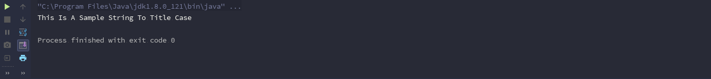

<div dir="rtl">

# عبارت های الحاقی در کاتلین و خلاصه بخش نهم

کاتلین یک ویژگی خیلی مهم رو ساپورت میکنه به نام توابع الحاقی، که درواقع از C# الهام گرفته شده. ایده پشت این ویژگی اینه که من بتونم یک تابع رو به یک کلاس الحاق کنم بدون این که از اون کلاس ارث بری کنم 

کد زیر رو نگاه کنین: 

</div>

```kotlin
fun String.hello(){
    println("It's me")
}
```

<div dir="rtl">

در واقع اینجا یک الحاق به کلاس String انجام دادیم. یک تابع جدید به کلاس String اضافه کردیم که تنها یک رشته رو چاپ میکنه و برای استفاده ازش کافیه بنویسیم :

</div>

```kotlin
fun String.hello(){
    println("It's me")
}

fun main(args: Array<String>) {
    "Sina".hello()
}
```

<div dir="rtl">

'و خب اگه اجراش کنین متوجه میشین که تابع الحاقیمون رو اجرا کرده.

خب بیاین یک تابع مفیدتر بنویسیم:

</div>

```kotlin
fun String.toTilteCase(): String {
    return this.split(" ").joinToString(" ") { it.capitalize() }
}
```

<div dir="rtl">

نیاز نیست که حالا درمورد این زنجیره و توابع داخلش نگران باشین، چیزی که اینجا مهمه اینه که با استفاده از this مقدار خود String که این تابع به اون الحاق شده رو داخل تابع الحاقیمون استفاده کردیم.

</div>

```kotlin
fun String.toTilteCase(): String {
    return this.split(" ").joinToString(" ") { it.capitalize() }
}

fun main(args: Array<String>) {
    println("this is a sample string to title case".toTilteCase())
}
```


