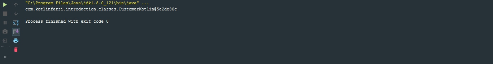

<div dir="rtl">

# کلاس های دیتا در کاتلین

تا اینجا یاد گرفتیم چگونه یک کلاس بسازیم، چگونه خاصیت های داخل اون کلاس رو بسازیم و غیر و غیره و درواقع ما خیلی از زمان ها هست که کلاس رو میسازیم و خاصیت هارو داخلش میاریم ولی متوجه میشیم که این کلاس ها فعالیت زیادی نمیکنن، یعنی به نحوی کلاس هایی هستن که نوع دیتامون رو معرفی میکنن، Data-Object های ما هستند یا به اصطلاح توی دنیای جاوا به Java-Beans مشهور هستند.

به خاطر این که کمی بیشتر اشناتون کنم بذارین یک کلاس توی جاوا بسازیم

</div>

```java
public class CustomerJava {
    private int id;
    private String name;
    private String email;

    public int getId() {
        return id;
    }

    public void setId(int id) {
        this.id = id;
    }

    public String getName() {
        return name;
    }

    public void setName(String name) {
        this.name = name;
    }

    public String getEmail() {
        return email;
    }

    public void setEmail(String email) {
        this.email = email;
    }

    @Override
    public String toString() {
        return "CustomerJava{" +
                "id=" + id +
                ", name='" + name + '\'' +
                ", email='" + email + '\'' +
                '}';
    }

    @Override
    public boolean equals(Object o) {
        if (this == o) return true;
        if (o == null || getClass() != o.getClass()) return false;

        CustomerJava that = (CustomerJava) o;

        if (id != that.id) return false;
        if (name != null ? !name.equals(that.name) : that.name != null) return false;
        return email != null ? email.equals(that.email) : that.email == null;
    }

    @Override
    public int hashCode() {
        int result = id;
        result = 31 * result + (name != null ? name.hashCode() : 0);
        result = 31 * result + (email != null ? email.hashCode() : 0);
        return result;
    }
}
```

<div dir="rtl">

این یک از data-class هایی هست که داخل جاوا میسازیم، در واقع اون کسایی که با جاوا کارکردن میدونن که برای ساختن همچین کلاس هایی چه قد کر باید زده بشه، درواقع ما تنها 3 خاصیت داریم و گتر و ستر های اون و 3 تابع toString و equal و hashcode . توابعی که توی دیتا بینز هامون زیاد استفاده میکنیم. یکی از هدف های کاتلین این بوده که بتونیم کدمون رو به مراتب ساده تر و کوچیکتر بنویسیم. حالا به خاطر این که بیشتر قدر کاتلین رو بدونید همین کلاس رو توی کاتلین میسازم که متوجه بشین چه خوبی هایی این زبون داره

درواقع ما getter و setter هامون رو که قبلا یادگرفتیم ک چجوری بنویسیم، اینجوری بود

</div>

```kotlin
class CustomerKotlin(var id: Int, var name: String, var email: String)
```

<div dir="rtl">

همینو مینویسیم و تموم، گتر و ستر هامون امادس. حالا بیاین و من یک main زیرش درست کنم و چند خط کد دیگه بنویسم:

</div>

```kotlin
fun main(args: Array<String>) {

    val customer = CustomerKotlin(1,"Sina","Sinadarvi@gmail.com")
    println(customer)
}
```

<div dir="rtl">

خب ما درواقع توی کلاس CustomerJava یک تابع داشتیم به نام toString که بهمون یک چیز شسته رفته تحویل بده، همین انتظار رو از کاتلین هم داریم، یعنی گفتم اوکی کاتلین خلاصه تر میکنه ولی باید همون ویژگی های جاوا رو هم داشته باشه دیگه، خب اگه همین کد رو اجرا کنیم خواهیم دید



و این هم مسلما خروجی مد نظرمون نیست. خب برای این که همچین قابلیتی رو به کلاسمون بدیم تنها کاری که باید بکنیم اینه که از کلیدواژه data استفاده کنیم

</div>

```kotlin
data class CustomerKotlin(var id: Int, var name: String, var email: String)

fun main(args: Array<String>) {

    val customer = CustomerKotlin(1,"Sina","Sinadarvi@gmail.com")
    println(customer)
}
```

<div dir="rtl">

خب حالا چی ؟ حالا اگه همین کد رو اجرا کنیم خواهیم داشت


که همون چیزی هست که ما مدنظرمون داشتیم.البته این data تنها به این معنی نیست که فقط toString رو بهمون بده،درواقع hashCode و equals رو هم برامون درست میکنه.

بیاین ییک نکته رو اینجا نگاه کنیم.


</div>

```kotlin
class CustomerKotlin(var id: Int, var name: String, var email: String)

fun main(args: Array<String>) {

    val customer1 = CustomerKotlin(1,"Sina","Sinadarvi@gmail.com")
    val customer2 = CustomerKotlin(1,"Sina","Sinadarvi@gmail.com")

    if(customer1 == customer2){
        println("They are the same")
    }else{
        println("they are not the same")
    }
}
```

<div dir="rtl">

توجه کنین که کلید واژه data رو اینجا نداریم.خب حالا کد رو اجرا میکنیم.


متوجه شدیم که این دو شبیه هم نیستن.خب حالا بیاین و data رو برگردونیم

</div>

```kotlin
data class CustomerKotlin(var id: Int, var name: String, var email: String)

fun main(args: Array<String>) {

    val customer1 = CustomerKotlin(1,"Sina","Sinadarvi@gmail.com")
    val customer2 = CustomerKotlin(1,"Sina","Sinadarvi@gmail.com")

    if(customer1 == customer2){
        println("They are the same")
    }else{
        println("they are not the same")
    }
}
```

<div dir="rtl">

و حالا اجراش کنیم


همینطور که میبینین هردو به مانند هم شدن.

دفعه اول وقتی دو شی رو مقایسه کردیم به دلیل متفاوت بودن آدرس خونه هاشون، دو شی برابر نبود ولی وقتی دو کلاس دیتا با هم مقایسه میشن، دیگه کامپایلر به ادرس خونشون کار نداره، محتوای کلاس رو مقایسه میکنه.

کاتلین این اجازه رو میده بهمون که بتونیم از یک شی کپی بگیریم

</div>

```kotlin
var customer3 = customer1
var customer4 = customer1.copy()
```

<div dir="rtl">

در واقع شما میتونین از هر دو روش بالا استفاده کنین، یا مستقیم مقادیرش رو توی یک متغیر جدید بریزین و یا این که از تابع copy() استفاده کنید.خب البته استفاده از تابع copy() این قابلیت رو بهمون میده که بتونیم اون شی رو کپی کنیم با این تفاوت که خاصیت یا خاصیت های خاصی رو از شی اولی که داریم ازش کپی میگیریم رو تغییر بدیم.

</div>

```kotlin
var customer4 = customer1.copy(email = "Sina@Darvishi.com")
```

<div dir="rtl">

خب البته تموم حرف هایی که زدیم به این معنی نیستش که ما فقط محدودیم که از این توابع استفاده کنیم، بلکه میتونیم data رو حذف کنیم و مثلا toString() خودمون رو بنویسیم یا این که data رو نگه داریم و toString() کاتلین رو override کنیم.

</div>

```kotlin
data class CustomerKotlin(var id: Int, var name: String, var email: String){
    override fun toString(): String {
        return "{\"id\": \"$id\", \"name\": \"$name\"}"
    }
}
```
