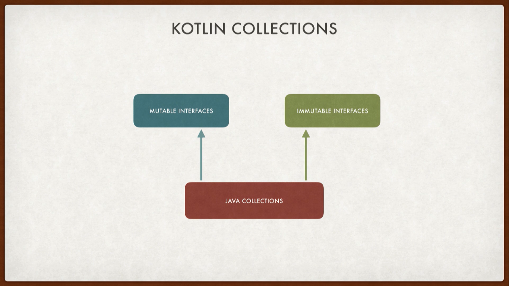

<div dir="rtl">

# کتابخانه استاندارد کاتلین و کارکردن با کالکشن ها در کاتلین

کاتلین به همراه یک کتابخونه استاندارد میاد که یکسری توابع و Annotation ها داره و میتونه توسعه نرم¬افزار رو برامون راحت¬تر کنه. این کتابخونه اندازه خیلی کوچیکی ( نزدیک به 800KB ) داره و سعی بر این میشه که همینطور کوچیک نگه داشته بشه.همچنین تعداد زیادی از توابع High-Order داخلش هست که برای functional-programming ارائه شده و تعداد زیادیشون درواقع توابع الحاقی هستند. کاتلین درواقع collection های  خودش رو نداره! درواقع فعلا کالکشن های خودش رو نداره.(در حال حاظر که این متن ترجمه میشه، کالکشن های کاتلین موجود است)، چیزی که کاتلین داره در واقع تعدادی از interface هاست که برروی collection های جاوا ارائه شدن.



که از تعدادی interface مسون و قابل تغییر تشکیل شده¬اند و این حالتی رو برامون فراهم کرده که بتونیم به صورت مسون از کالکشن¬ها استفاده کنیم.

کالکشن ها از List ها، Array ها، Map ها، Set ها، HashMap ها، HashSet و خیلی چیز های دیگه تشکیل شده.

خب حالا بیاین یکم کد بزنیم و کتابخونه استاندارد رو نگاه کنیم.

</div>

```kotlin
fun main(args: Array<String>) {
    var list: List<String> = ArrayList()
}
```

<div dir="rtl">

الان نمیخوایم زیاد شیرجه بزنیم توی کدزنی، فعلا یک آرایه درست کریم و مقداردهیش هم کردیم. درحال حاظر شما اگه با جاوا کارکرده باشین با ArrayList آشنا هستین، ولی چیزی که باهاش آشنا نیستین، List هه. بیاین به تعریف List رجوع کنیم.


اگه کامنت¬های بالای List رو بخونین متوجه میشین که تمامی متدهای داخل این اینترفیس تنها قابل خواندن هستن و اگر بخوایم متدهایی هم قابل خواند و هم قابل نوشتن استفاده کنیم باید از اینترفیس MutableList استفاده کنیم.

حالا اگه به تعریف ArrayList مراجعه کنیم متوجه میشیم که درواقع یک کلاس جاواست که یکسری متدها داره که میشه ازشون استفاده کرد و لیست رو بزرگ و کوچیک کرد.

و همینطور که متوجه شدین این راه حل منطقی نیست، چراکه من دارم یک لیست از غیرمسون میسازم و اونو به لیستی میدم که مسونه! درواقع ما توی کاتلین لیست¬هامون رو اینجوری تعریف نمیکنیم و همینطور که توی جلسات قبل دیدن ما لیست هامون رو اینجوری توی کاتلین تعریف میکنیم:

</div>

```kotlin
var list: List<String> = listOf("first Entry","second Entry")
```

<div dir="rtl">

این listOf() چیه ؟ اگه به سمت تعریفش هدایت شین متوجه میشین که این درواقع یک تابع کمکیه که یک لیست مسون میسازه.


درواقع یک emptyList() میسازه و اگه به تعریفش رجوع کنین متوجه میشین که یک لیست از Nothing هه که در نتیجه یک لیست مسون برامون ساخته.

زمانی که حرف از ساختن یک کالکشن میرسه بهتره که ما تاجای ممکن از کتابخونه استاندارد استفاده کنیم.

به عنوان مثال اگه بخوایم یک لیست از شماره ها درست کنیم مینوشتیم :

</div>

```kotlin
val numbers = 1..10
```

<div dir="rtl">

و اینجا این دونقطه`..` درواقع تابع `rangeTo()` ماست، و اگه بخوایم یک لیست از شهر ها بسازیم مینوشتیم:

</div>

```kotlin
val cities = listOf("Madrid","London","Paris")
```

<div dir="rtl">

همچنین کالکشن¬های دیگه¬ای هم هست که میشه ازشون استفاده کرد.

خب بیاین یکم با این cities کار کنیم.کد زیر رو نگاه کنین:

</div>

```kotlin
println(cities.javaClass)
```

<div dir="rtl">

درواقع اینجا javaClass میاد و تایپ اون شی رو برمیگردونه و اگه این رو اجرا کنیم نتیجه این میشه:


و متوجه میشیم که درواقع داریم همون ArrayList رو استفاده میکنیم.

</div>


