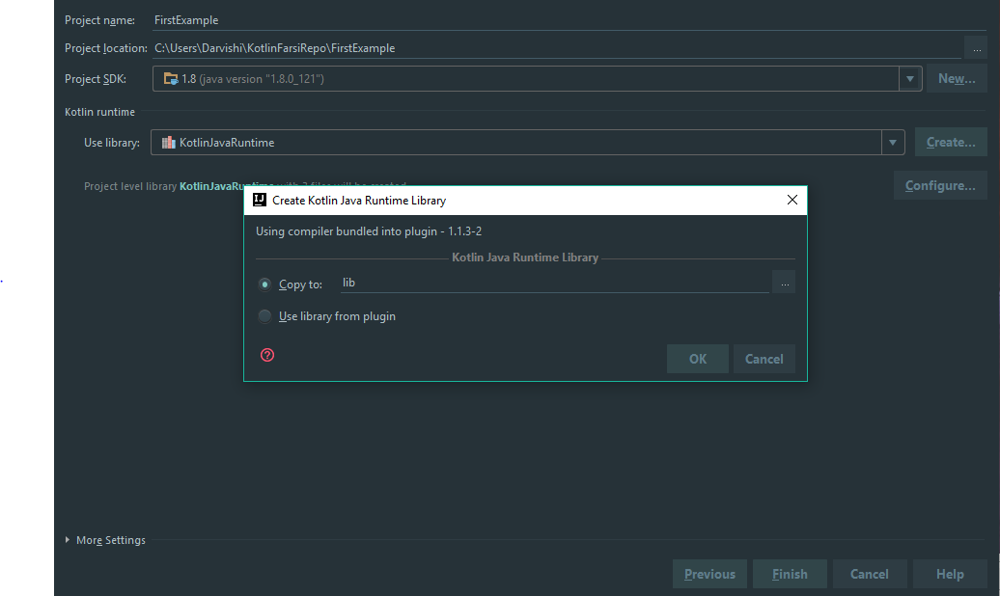
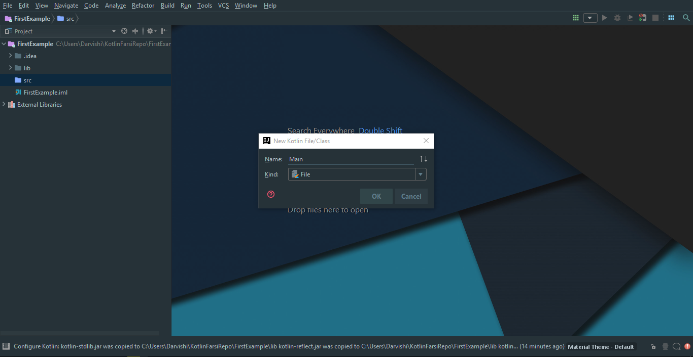

<div dir="rtl">

# کاتلین با IntelliJ IDEA

خب تا اینجا یادگرفتیم چگونه با استفاده از Command line و یک Text Editor برناممون رو بنویسیم و اجرا کنیم. ولی خب ما بیشتر این دوره رو از IntelliJ IDEA استفاده میکنیم و فرقی نمیکنه که شما از نسخه رایگان یا پولی این محصول استفاده میکنید، در هر دو صورت میتونید همراه ما باشید. البته IDE های دیگری هم هستند که کاتلین رو ساپروت میکنند به مانند Eclipse,Vim,VSCode و به مانند این ها چندین IDE دیگری هستند که کاتلین رو ساپورت میکنند.

IntelliJ رو باز کنید و روی Create New Project کلیک کنید. 


بعد از اون با صفحه ای مواجه میشید، از سمت چپ گزینه کاتلین را پیدا کرده و بر روی ان کلیک میکنیم، سپس از صفحه ای که سمت راست برامون ظاهر میشه Kotlin (JVM)  رو انتخاب میکنیم.


ما بعدا گزینه های maven و gradle رو هم برای ساخت برنامه های کاتلین بررسی میکنیم ولی فعلا از ورژن ساده IntelliJ استفاده میکنیم. برروی گزنه Next کلیک میکنیم. 


خب اسم پروژه و محل قرارگیری پروژه رو مینویسیم. من اینجا از  JDK 1.8 استفاده میکنم و قسمت پایینی هم همونیه که دربارش صحبت کردیم، رانتایم کاتلین. اگه روی Create کلیک کنیم:



میبینم که اینجا دو گزینه دارم یا از لایبری پلاگین شده در IntelliJ استفاده کنم و یا این که از ورژن Include شده در برنامم که بسته به نوع برنامه ای که میخواید توسعه بدید اون رو انتخاب کنید. نکته ای که هست اینکه من اینجا همینطور که میبینید از ورژن 1.1.3-2 استفاده میکنم، ترجیحا اگر نسخه جدید آن را آپدیت کنید و همراه ما باشید.

خب بعد از بستن این پنجره بر روی دکمه Finish کلیک میکنم و IntelliJ فولدر مناسب رو برام میسازه.


ظاهر برنامم اینجوریه که میبینید، حالا شاید به خاطر ورژن های متفاوت کاتلین و یا آپدیت های IntelliJ با ظاهری دقیقا به این شکل مواجه نشید ولی در حالت کلی به این صورت هست که میبینید.

برروی فولدر src راست کلیک میکنم مسیر New>Kotlin File/Class میرم و فایل Main رو میسازم.



و میبینم که فایل Main.kt در زیرشاخه src ساخته شده


اگر دقت کنیم میبینیم که هیچ ساختار پکیجی اینحا مشاهده نمیکنیم، چرا که ما پکیجی برای این فایل درست نکردیم.

خب اینجا من تنها کلمه main رو مینویسم و دکمه Tab رو فشار میدم و کاری که IntelliJ اینجا برامون انجام میده اینه که یک تابع Main رو برام درست میکنه. دقیقا مثل جاوا که ما اگه کلمه psvm رو مینوشتیم تابع استایک Main رو برامون درست میکرد، اینم دقیقا همون کارو برای کاتلین انجام میده.

حالا اگه من کد زیر رو بنویسم:

</div>

```kotlin
fun main(args: Array<String>) {
    val message = "Hello From IDEA!"
    println(message)
}
```

<div dir="rtl">

حالا میتونیم پروژه رو ران کنیم و نتیجه رو ببینیم.


من همچنین میتونم دیباگ کنم.روی یک خط از برنامه با کلیک کردن روی نوار کناری علامت میذارم و دوباره روی شکلک کاتلین کلیک میکنم و این دفعه گزینه دیباگ رو میزنم.


بنابراین استفاده از IntelliJ این امکان رو میده که ما بتونیم برناممون رو کامپایل،اجرا دیباگ و خیلی کار های دیگه روش انجام بدین. ضمنا یادتون نره که Kotlin توسط همین شرکتی که IntelliJ رو ساخته درست شده و مطمئن باشید اگه قرار باشه ویژگی خاصی رو در کاتلین ببنین اولین بار با استفاده از IntelliJ اونو خواهید دید.

</div>
