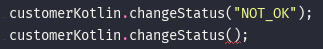

<div dir="rtl">

# صحبت کردن با کاتلین از جاوا

حالا میخوایم یکم از کاتلین داخل Java استفاده کنیم.بیاین یک کلاس جاوا با نام TalkingToKotlin بنویسیم:

</div>

```java
public class TalkingToKotlin {
    public static void main(String[] args) {
        CustomerKotlin customerKotlin = new CustomerKotlin(1,"Sina",null);
    }
}
```

<div dir="rtl">

یادتون میاد که کلاسی داشتیم به نام CustomerKotlin که چند متغییر غیر null داخل خودش داشت.

</div>

```kotlin
data class CustomerKotlin(var id: Int, var name: String, var email: String)
```

<div dir="rtl">

کاتلین متوجه این موضوع میشه و زمانی که داریم یک متغییر از این کلاس میسازیم اینو در نظر میگیره و بهمون میگه این متغییر نمیتونه مقدار null بگیره! درواقع ما میتونیم مقدار null وارد کنیم ولی خود کامپایلر بهمون اخطار میده که نباید مقدار null وارد بشه


حالا فرض کنین میخوایم به یک متغیر کلاس کاتلین در داخل کلاس جاوا دسترسی داشته باشیمو چیزی که توی جاوا تعریف نشده اینه که دسترسی مستقیم به متغیره! اینجا راه حل خیلی سادس. شما میتونین از متد های set و get استفاده کنین.

</div>

```java
customerKotlin.setEmail("Sina@darvishi.net");
```

<div dir="rtl">

ولی خب درمورد متغیر های field چی ؟ اگه یادتون باشه توی کاتلین field نداریم، توی کاتلین تنها خصیصه معنی پیدا میکنه. چه اتفاقی میفته وقتی توی جاوا هستیم ؟ توی جاوا مفهومی به نام field داریم. 

بیاین به کلاس CustomerKotlin مراجعه کنیم و یک خصیصه به اون اضافه کنیم.

</div>

```kotlin
data class CustomerKotlin(var id: Int, var name: String, var email: String){
    var someProperty = "Value"
    override fun toString(): String {
        return "{\"id\": \"$id\", \"name\": \"$name\"}"
    }
}
```

<div dir="rtl">

حالا بیاین برگردیم و از این خصیصه توی کلاس جاوامون استفاده کنیم


خب همینطور که میبینین متوجه میشیم که ما نمیتونیم به این متیغیر به مانند یک field دسترسی پیدا کنیم ولی اگه بخوایم به مانند یک field به او دسترسی پیدا کنیم باید چه کاری انجام بدیم؟ در واقع اینجا کاتلین برامون Annotation های قرار داده تا بتونیم این اعمال هارو انجام بدیم.

</div>

```kotlin
@JvmField var someProperty = "Value"
```

<div dir="rtl">

و حالا به راحتی میتونیم به مانند یک field به متغییرمون دسترسی داشته باشیم

</div>

```java
customerKotlin.someProperty = "this is not Property No more";
```

<div dir="rtl">

همینطور که میدونین ما توی کاتلین توابعی داریم که میتونن مقادیر پیشفرض برای ورودیهاشون داشته باشن. چجوری توی جاوا با اینگونه توابع رفتار میشه؟ بیاین یه تابع به کلاس CustomerKotlin اضافه کنیم:

</div>

```kotlin
fun changeStatus(status: String = "OK"){

}
```

<div dir="rtl">

و حالا اگه بخوایم ازشون استفاده کنیم به ارور میخوریم



خب به مانند مشکل قبلی کاتلین برامون Annotation هایی گذاشته که بتونیم این مشکل هارو برطرف کنیم.کافیه اینطور بنویسیم:

</div>

```kotlin
@JvmOverloads fun changeStatus(status: String = "OK"){

}
```

<div dir="rtl">

درواقع این Annotation میاد برامون Overload هارو فراهم میکنه.


    مطالب این قسمت کامل نشده است.
</div>


