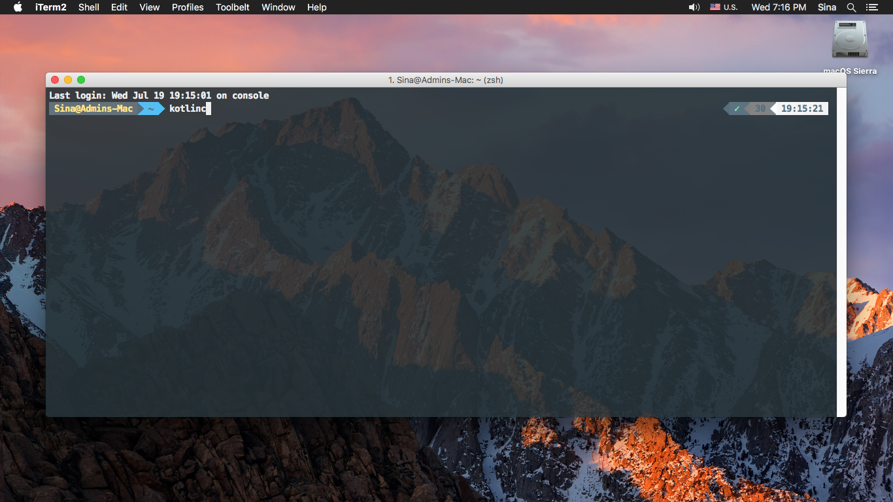

# کاتلین REPL

زمانی که کاتلین رو نصب میکنیم همونطور که دیدید دستور زیر رو در Command Line زدیم.

محیطی رو برامون بالا میاره که بهش Kotlin REPL میگیم  و مخفف Kotlin, Read Eval Print Loop هه که میتونیم بگیم یک محیط ساده تعاملی با کامپایلره و میشه با اون یک سری چیز هارو امتحان کنیم.همینطور که شما می بینین من یک سری کد اینجا مینویسم واین محیط از کامپایلر میخواد که این دستورات رو انجام بده و نتیجش رو پرینت کنه.

مثلا:

ما حتی می تونیم تابع بنویسیم.بعدا در مورد جزئیات صحبت میکنیم ولی فعلا به عنوان مثال این تابع رو نگاه کنید:

ما میتونیم حتی کدمون رو توی چند خط بنویسیم:

خب، تا اینجا متوجه شدیم که اینREPL  رو میتونیم با استفاده از دستور kotlinc در محیط کنسول اجرا کنیم و کنسول هم این محیط تعاملی رو بالا میاره. همینطور میتونیم این محیط رو از یک روش دیگه بالا بیاریم که مقداری فیدبک بیشتری از کدی که زدیم میگیریم و اون هم استفاده از REPL داخل IntelliJ IDEA است که مقداری تجربه کاربری رو افزایش میده. خب پس میریم IntelliJ رو بالا میاریم و یک پروژه جدید شروع میکنیم. و اگر بریم به سمت Tools>Kotlin>kotlin REPL متوجه میشیم که دقیقا همون محیط رو در اینجا داریم.

 ولی یکی از خوبی های این محیط اینه که در اینجا همگردانی و اطلاعت پارامتر ها و ... رو داریم، بدین صورت که میتونیم از کمکی که IntelliJ میکنه بهمون استفاده کنیم. حال اگر دوباره دستورات گذشته را وارد کنیم متوجه خواهیم شد که:
 

#### >>> fun hello(name: String){ print(name)}
#### >>> hello(“Kotlin REPL”)
#### Kotlin REPL
