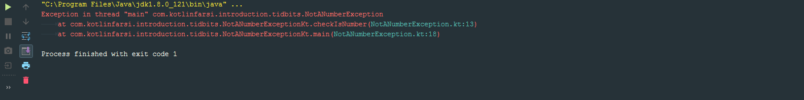

<div dir="rtl">

# کار کردن با exception ها

    پیشنهاد میشه این جلسه رو بر روی IntellJ IDEA امتحان کنید
    
یکی از مشکلاتی که سعی میکنیم با کاتلین از بین ببریمش چک کردن Exception هاست. مثلاً در جاوا اگر یک متد بخواد Null Runtime Exception رو throw کنه باید صریحا بیان کنه. ایده پشت این قضیه اینه که توسعه دهنده ها بلاک های try-catch اشون رو بنویسن و خب اگه این اتفاق بیفته همه چیز فوق العاده میشه و برنامه بدون نقص اجرا میشه ولی خب توی واقعیت اینطور نیست. درواقع خیلی از توسعه دهنده ها کدهایی که باید مینوشتن رو نمینوشتن بنابراین توی توسعه زبان کاتلین از این موضوع چشم پوشی شد. خب بیاین یک نگاه به Exception ها بندازیم و ببینیم چجوری توی این زبون کار میکنن.

یک کلاس درست میکنیم به نام NotANumberException و توش کد زیر رو میزنیم:

</div>

```kotlin
class NotANumberException : Throwable() {

}
```

<div dir="rtl">

در کاتلین کلاس پایه ای برای Exception ها کلاس Throwable است که اگر به سمت تعریفش هدایت بشین میبینین که کلاس ساده ای هستش که تنها دو خصیصه و چنتا constructor داره.

•	در IntelliJ IDEA برای هدایت شدن به سمت تعریف ، تنها لازم است که موشواره خود را بر روی نام عبارت برده و دکمه Ctrl را نگه داشته و بر روی آن کلیک کنید.

 و حالا برای این که بتونیم ازش استفاده کنیم تنها کاری که باید بکنیم اینه که کلاس NotANumberException رو throw کنم.


</div>

```kotlin
class NotANumberException : Throwable() {

}

fun main(args: Array<String>) {
    throw NotANumberException()
}
```

<div dir="rtl">

و اگه این کد رو اجرا کنیم متوجه خواهیم شد که NotANumberException رو throw کردیم.

حالا بیایم و یکم این سناریو رو طبیعی تر کنیم

</div>

```kotlin
class NotANumberException : Throwable() {

}

fun checkIsNumber(obj: Any){
    when(obj){
        !is Int, Long, Float, Double -> throw NotANumberException()
    }
}

fun main(args: Array<String>) {
    checkIsNumber("A")
}
```

<div dir="rtl">

و همینطور که انتظار داریم اگه این برنامه رو اجرا کنیم



میبینیم همون Exception مورد انتظارمون رو throw کرد.

و خب اینجوری حالا میتونیم با try-catch این موضوع رو هندل کنیم

</div>

```kotlin
class NotANumberException : Throwable() {

}

fun checkIsNumber(obj: Any){
    when(obj){
        !is Int, Long, Float, Double -> throw NotANumberException()
    }
}

fun main(args: Array<String>) {

    try {
        checkIsNumber("A")
    } catch(e: NotANumberException) {
        println("It was not a number")
    }
}
```

<div dir="rtl">

حالا بیایم یکم با try-catch بازی کنیم، مثلا از فایل یک مقدار بخونیم

من توی شاخه ی اصلی یک فایل باز کردم به نام input.txt و داخلش یه متن کوچیک نوشتم. حالا میریم و یک سری خط کد مینویسم که از اون تابع بخونم. کدی که میزنیم خیلی از قسمتاش که مربوط به خوندن از فایل میشه که مهم نیست و خیلی شبیه جاواست:

</div>

```kotlin
fun main(args: Array<String>) {

    val buffer = BufferedReader(FileReader("input.txt"))
    try {
        val chars = CharArray(30)
        buffer.read(chars,0,40)
    }finally {
        println("Closing")
        buffer.close()
    }
}
```

<div dir="rtl">

خودتون متوجه هستین که من سعی کردم باعث ایجاد مشکل بشم، چون دارم 40 خونه از یک بافری که 30 خونه بیشتر نداره میخونم.

Finally در واقع همیشه انجام میشه، حتی اگر Exception هم بخوره. پس در واقع شما در اون قسمت مطمئنین حتی اگر هر چیز بدی هم اتفاق بیفته بازم این کد اجرا خواهد شد، پس میتونیم بسته شدن بافر رو توی اون قسمت قرار بدیم
وحالا اگه برنامه رو اجرا کنیم میبینیم که


ارور indexOutOfBoundException رو گرفتیم، چون همونطور که خودمون میدونستیم داریم 40 تا از یک آرایه 30 خونه ای میخونیم. ولی اگه دقت کنید، به هر حال Closing اجرا شده!

اگه یادتون باشه از قسمت if، ماتونستیم یک عبارت شرطی رو به یک متغیر بدیم. با بلاک try-catch هم همینکار رو میتونیم انجام بدیم.

</div>

```kotlin
fun main(args: Array<String>) {
    val buffer = BufferedReader(FileReader("C:/Users/Darvishi/IdeaProject/KotlinFarsiRepo/src/input.txt"))
    val result = try {
         val chars = CharArray(30)
         buffer.read(chars,0,40)
    }catch (e: IndexOutOfBoundsException){
         "Exception handled"
    }finally {
          println("Closing")
          buffer.close()
    }

    println(result)
}
```

<div dir="rtl">

دقیقا به مانند if و when که اخرین خط مقدارش تعلق میگرفت به متغیر، اینجا هم اخرین خط مقدارش تعلق میگیره به متغیر. فقط یادتون باشه که مقادیر بلاک catch به متغیر تعلق میگیرند، نه مقادیر بلاک finally .

</div>
